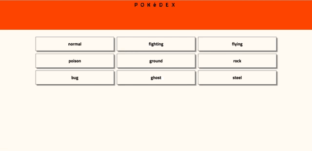

# Pokedex

## Setup

This application is built from create-react-app

- `npm install`
- `npm start`
- Pull down the api https://github.com/turingschool-examples/poke-api

## Itteration: 0

Make an http request to `localhost:3001/types`. Once you've received the pokemon type data from the api you'll want to store it in the redux store.

## Itteration 1

Lets work on the visual layer!

Once you've populated the redux store with all the type data you are going to want to display them as Cards. While we wait for the data please give your app a loading gif.

Before you move onto itteration 2  you need to start testing your actions, reducers, containers, and components.

## Itteration 2

If you look at the `type` data you'll notice that a `pokemon` array. This contains an array of pokemon id's. You'll have to make a `get` request to `http://localhost:3001/pokemon/:id` to retrieve the corresponding pokemon.

This data should not be displayed until the user clicks on the card. You can solve this any way you'd like. If you decided to use router you might want to consider creating a dynamic route to render the pokemon

Display the following for each pokemon:
`name`, `type`(type name), `weight`, and display one of the pokemon `sprites`  
