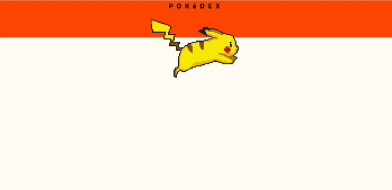

# Pokedex

## Setup

This application is built from create-react-app

- `npm install`
- `npm start`
- Pull down the api https://github.com/turingschool-examples/poke-api

## Itteration: 0

Make an http request to `localhost:3001/types`. Once you've received the pokemon type data from the api you'll want to store it in the redux store.

## Itteration 1

Lets work on the visual layer!

Once you've populated the redux store with all the type data you are going to want to display them as Cards. While we wait for the data please give your app a loading gif.

## Itteration 2

If you look at the `type` data you'll notice there is a `pokemon` array that contains pokemon id's. You'll have to make a `get` request to `http://localhost:3001/pokemon/:id` to retrieve the corresponding pokemon.

This data should not be displayed or fetched until the user clicks on the card. You can solve this any way you'd like. 

Display the following for each pokemon:
`name`, `type`(type name), `weight`, and display one of the pokemon `sprites`  

## Extensions

* Testing (actions, reducers, containers and components)
* Middleware (thunks or sagas)
